# 詳細設計書.md

## 1. アプリケーションの構成
### 1.0. フォルダ構造

```scss
│  index.html
│  README.md
│  script.js
│  styles.css
│  timerAction.js
│
├─docs
│      Detailed_Design_Document.md
│      Development_Guide.md
│
└─img
        favicon.ico
```


### 1.1. HTML構造

- mode-container
  - タイマーとストップウォッチのモード選択ラジオボタン
- stopWatch-container
  - ストップウォッチモードの表示と操作ボタン
- Timer-container
  - タイマーモードの表示、時間設定入力、および操作ボタン

### 1.2. JavaScript機能

- ストップウォッチ機能
  - スタート
  - ストップ
  - リセット
- タイマー機能
  - 時間設定
  - スタート
  - ストップ
  - リセット

### 1.3. フロー図

```mermaid
graph TD
  A[アプリ起動] --> B[ストップウォッチまたはタイマーモード選択]
  B --> C[ストップウォッチモード]
  B --> D[タイマーモード]
  C --> E[STARTボタン]
  C --> F[STOPボタン]
  C --> G[RESETボタン]
  D --> H[時間入力]
  D --> I[STARTボタン]
  D --> J[STOPボタン]
  D --> K[RESETボタン]
  E --> L[ストップウォッチ実行中]
  F --> M[ストップウォッチ停止]
  G --> N[ストップウォッチリセット]
  I --> O[タイマー実行中]
  J --> P[タイマー停止]
  K --> Q[タイマーリセット]
  H --> R[時間入力完了]
  L --> F
  M --> E
  M --> G
  O --> J
  O --> K
  P --> I
  P --> K

```



## 2. 各機能の詳細

### 2.1. ストップウォッチ機能

1. スタート
   - クリックされたとき、ストップウォッチを開始します。
2. ストップ
   - クリックされたとき、ストップウォッチを一時停止します。
3. リセット
   - クリックされたとき、ストップウォッチをリセットし、表示を 00:00:00 に戻します。

### 2.2. タイマー機能

1. 時間設定
   - 分数を入力し、タイマーのカウントダウンを設定します。
2. スタート
   - クリックされたとき、タイマーのカウントダウンを開始します。
3. ストップ
   - クリックされたとき、タイマーのカウントダウンを一時停止します。
4. リセット
   - クリックされたとき、タイマーをリセットし、表示を 00:00 に戻します。また、「Input Minutes」フィールドを再度有効にします。

